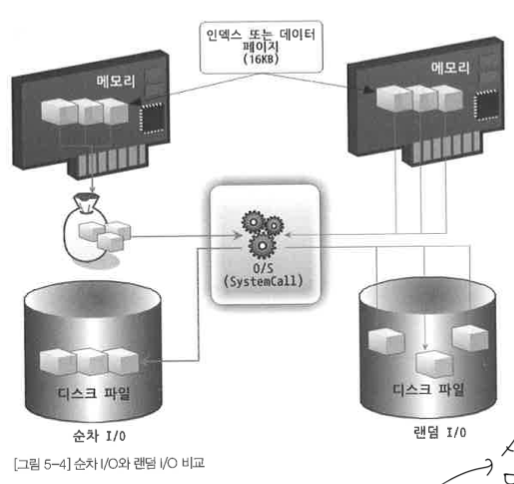
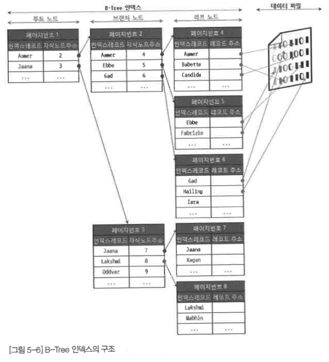
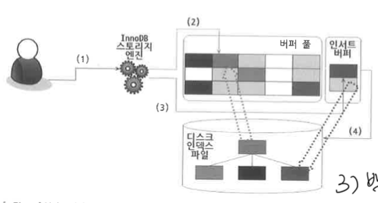
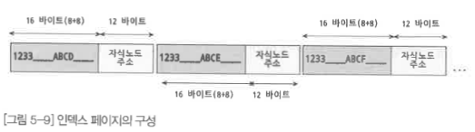

# 5.1 디스크 읽기 방식

- 데이터 베이스의 성능 튜닝은 어떻게 디스크 I/O를 줄이느냐가 관건

## 5.1.1 저장 매체

- 내장 디스크
    - 개인용 PC의 본체 내에 장착된 디스크와 같은 매체
    - 데이터 베이스 서버용으로 사용되는 장비는 일반적으로 4~6개 정도의 내장 디스크를 장착

- DAS
    - 내장 디스크의 용량 문제를 해결하기 위해 주로 사용
    - 독자적으로 사용할 수 없으며, 컴퓨터 본체에 연결해서만 사용 가능
    - SATA, SAS와 같은 케이블로 연결된다.
    - 내장 디스크와 성능이 비슷하다.
    - **DAS는 반드시 하나의 컴퓨터 본체에만 연결해서 사용할 수 있기 때문에 디스크의 정보를 여러 컴퓨터가 동시에 공유하는 것 불가능**

- NAS, SAN
    - 내장 디스크와 DAS의 문제점을 동시에 해결하기 위해 NAS사용
        - 여러 컴퓨터에서 공유해서 사용 가능
    - DAS, 내장 디스크는 SATA, SAS와 같은 케이블로 연결
        - **NAS는 TCP/IP를 통해 연결**
    - 케이블이 아니므로 속도가 매우 느리다.

- SAN
    - DAS로는 구축할 수 없는 아주 대용량의 스토리지 공간을 제공
    - 여러 컴퓨터 동시에 사용 가능
    - 광 케이블로 연결
        - 빠르고 안정적인 데이터 처리(읽, 쓰)를 보장
    - **고가의 구축 비용**

- NAS
    - TCP/IP로 데이터가 전송되기 때문에 빈번한 데이터 읽고 쓰기가 필욯나 데이터 베이스 서버용으로 거의 사용되지 않는다.

- 언급된 모든 저장 매체는 내부적으로 1 개 이상의 디스크 드라이브를 장착하고 있다.
- 저장 매체는 디스크 드라이브의 플래터 (디스크 드라이브 내부의 데이터 저장용 원판)를 회전시켜 데이터를 읽고 쓰는 기계적인 방법을 사용

## 5.1.2 디스크 드라이브와 솔리드 스테이트 드라이브

- DB 서버에서는 항상 디스크 장치가 병목 지점
- 기계식 저장 매체는 느리기 때문에 전자식 저장 매체인 SSD를 많이 사용

- SDD
    - 기존의 디스크 드라이브에서 데이터 저장용 플래터를 제거
    - 대신 플래시 메모리 장착
    - 디스크 원판을 기계적으로 회전시킬 필요가 없으므로 아주 빨리 데이터 읽,쓰 가능
    - 플래시 메모리는 전원이 공급되지 않아도 데이터가 삭제되지 않는다.

- 디스크 헤더를 움직이지 않고 한번에 많은 데이터를 읽는 순차 I/O 의 경우 SSD가 디스크 드라이브보다 조금 빠르거나 거의 비슷한 성능
- 하지만, 랜덤 I/O는 훨씬 더 빠르다
    - 디스크를 회전 시키며 데이터의 위치를 찾지 않아도 되기 때문에

- DB 서버에서는 순차 I/O 작업은 그다지 비중이 크지 않고 랜덤 I/O를 통해 작은 데이터를 읽고 쓰는 작업이 대부분이므로 SSD의 장점은 DBMS용 스토리지 최적

## 5.1.3 랜덤 I/O와 순차 I/O

- 이하 랜덤 I/O는 랜덤으로 순차 I/O는 순차로 표현하겠다.

- 랜덤이란 표현은 플래터를 돌려서 읽어야할 데이터가 저장된 위치로 디스크 헤더를 이동시킨 다음에 데이터를 읽는 것을 의미
    - 사실, 순차도 이 작업은 같다

- 위에서 순차는 3개의 페이지를 디스크에 기록하기 위해 1번 시스템 콜을 요청
- 랜덤은 같은 기능을 위해 3번 시스템 콜을 요청
- **즉, 디스크 기록 위치를 찾기 위해 순차는 디스크의 헤드를 1번 이동, 랜덤은 3번 이동**

- 디스크 성능은 디스크 헤더의 위치 이동 없이 얼마나 많은 데이터를 한 번에 기록하느냐에 의해 결정
- 그래서 여러번 쓰기 또는 읽기를 요청하는 랜덤 I/O 작업이 훨씬 작업의 부하가 커진다.

# 5.2 인덱스란?

1. **정렬**
2. **key = 칼럼, value = 주소값**

---

- SortedList ⇒ 인덱스
    - 정렬을 유지
    - 장: 원하는 값을 빨리 찾는다.
    - 단: 저장 과정에서 정렬의 비용이 든다.
- ArrayList ⇒ 데이터 파일
    - 별도의 정렬 없이 그대로 저장
    - 장: 그냥 저장 가능
    - 단: 찾기 느림

---

**역할에 따른 인덱스**

- 프라이머리 키
    - 레코드 대표 칼럼의 값으로 만들어진 인덱스
    - NULL값 허용, 중복 허용 X

- 보조 인덱스
    - 프라이머리 키 이외의 모든 인덱스
    - 유니크 인덱스
        - 프라이머리 키와 성격 비슷
        - 프라이머리 키를 대신해서 사용 ⇒ 대체키 라고도 부름

---

**데이터 저장 방식 (알고리즘) 별로 구분**

- B-Tree 인덱스
    - 일반적으로 사용
    - 칼럼의 값 변경하지 않고 원래의 값을 이용해 인덱싱

- Hash 인덱스
    - 칼럼의 값으로 해시값을 계산해 인덱싱
    - 장: 매우 빠른 검색 지원
    - 단: 값을 변형해서 인덱싱하므로, 값의 일부만 검색하고자 할 때는 인덱스를 사용할 수 없다.
    - **메모리 기반의 데이터 베이스에서 많이 사용**

- Fractal-Tree 인덱스
    - 값을 변형하지 않고 인덱싱하며 범용적인 목적으로 사용할 수 있다.
    - 데이터가 저장되거나 삭제될 때 처리 비용을 **B-Tree보다** 상당히 줄일 수 있다.

---

**데이터의 중복 허용 여부로 분류**

- 유니크 인덱스
    - 유니크 인덱스에 대해 동등조건 (Equal, =)로 검색한다는 것은 항상 1건의 레코드만 찾으면 더 찾지 않아도 된다는 것을 옵티마이저에게 알려주는 효과

- 유니크하지 않은 인덱스

---

**인덱스의 기능별 분류**

- 전문 검색용 인덱스

- 공간 검색용 인덱스

## 5.3 B-Tree 인덱스

- DBMS에서는 B+-Tree, B*-Tree가 사용
- 칼럼의 원래 값을 변형시키지 않고 인덱스 구조체 안에서 항상 정렬된 상태 유지
- 전문 검색과 같은 특수 요건이 아닌 경우 B-Tree를 사용할 정도로 일반 용도에 적합한 알고리즘

### 5.3.1 구조 및 특성

- 루트 노드
    - 트리 구조 최상위
    - 자식 노드가 붙어 있음

- 리프 노드
    - 가장 하위에 있는 노드
    - 실제 데이터 레코드를 찾아가기 위한 **주소값** 을 가지고 있다.

- 브랜치 노드
    - 중간의 노드

- **인덱스의 키값은 모두 정렬, 데이터 파일의 레코드는 정렬돼 있지 않다.**

- 데이터 파일의 레코드는 INSERT된 순서대로 저장되는 것인가?
- 대부분의 RDBMS의 데이터 파일에서 레코드는 특정 기준으로 정렬되지 않고 임의의 순서대로 저장된다. 하지만 InnoDB 테이블에서 레코드는 클러스터되어 디스크에 저장되므로 기본적으로 프라이머리 키 순서대로 정렬되어 저장된다.

- 리프노드는 데이터 파일에 저장된 레코드의 주소라고 했다.
    - 오라클에서는 물리적인 레코드 주소
    - MyISAM에서는 내부적 레코드의 아이디(번호)
    - InnoDB에서는 프라이머리 키에 의해 클러스터링되기 때문에 프라이머리 키 값 자체가 주소 역할을 한다.

### 5.3.2 B-Tree 인덱스 키 추가 및 삭제

**인덱스 키 추가**

- 스토리지 엔진에 따라 즉시 인덱스에 저장될 수도 그렇지 않을 수도 있다.
    1. B-Tree에 저장될 때는 저장될 키 값을 이용해 B-Tree 상의 적잘한 위치를 검색해야한다.

    2-1. 리프노드가 꽉 차지 않았을 때: 레코드의 키 값과 대상 레코드의 주소 정보를 리프 노드에 저장

    2-2. 리프노드가 꽉 차서 더는 저장할 수 없을 때: 리프 노드가 분리돼야 하는데, 이는 상위 브랜치 노드 까지 처리 범위가 넓어진다.

- 그러므로 상대적으로 쓰기 작업에 비용이 많이 든다.

- 테이블에 레코드를 추가하는 작업 비용을 1 이라 쳤을 때, 인덱스에 키를 추가하는 작업 비용을 1~1.5 정도로 예측하는 것이 일반적
- 이 비용의 대부분이 메모리와 CPU에서 처리하는 시간이 아니라 **디스크로부터 인덱스 페이지를 읽고 쓰기를 해야하기 때문에 시간이 오래 걸리는 것**

- MyISAM, Memory 스토리지 엔진의 경우
    - 삽입이 실행되면 즉시 새 키 값을 인덱스에 반영
    - B-Tree에 키를 추가하는 작업이 완료될 때까지 클라이언트는 쿼리의 결과를 받지 못하고 기다리게 된다.
    - `delay-key-write` 파라미터로 인덱스 키 추가 작업을 (지연) 처리할 수 있다.
        - 그러나, 이는 동시 작업 환경에서는 적합하지 않다.

- InnoDB의 경우
    - 상황에 따라 적절하게 인덱스 키 추가 작업을 지연시켜 나중에 처리할 지, 아니면 바로 처리할지 결정
    1. 사용자 쿼리 실행
    2. 버퍼 풀에 새로운 키 값을 추가할 페이지(리프 노드)가 존재한다면 즉시 키 추가 작업
    3. 리프 노드가 없다면, 인서트 버퍼에 추가할 키 값과 레코드의 주소를 임시로 기록해두고 작업 완료 (사용자 쿼리는 실행 완료)
    4. 백그라운드 작업으로 인덱스 페이지를 읽을 때에만 인서트 버퍼에 머지해야할 인덱스 키 값이 있는지 확인한 후, 있다면 병합함(B-Tree에 인덱스 키과 주소를 지정)
    5. DB 서버 자원의 여유가 생기면 MySQL 서버의 인서트 버퍼 머지 스레드가 조금씩 인서트 버퍼에 임시 저장된 인덱스 키와 주소 값을 머지(B-Tree에 인덱스 키와 주소를 저장)시킴

- 위 지연 처리 기능은 INSERT, DELETE 등 인덱스 키의 추가 및 삭제 작업까지 버퍼링해서 지연 처리할 수 있게 기능이 확장

**인덱스 키 삭제**

- 해당 키 값이 저장된 리프 노드를 찾아 그냥 삭제 마크만 하면 작업 완료된다.
- InnoDB는 삭제도 지연 처리 가능
- MyISAM, Memory 스토리지 엔진은 테이블에서는 인서트 버퍼와 같은 기능이 없으므로 인덱스 키 삭제가 완료된 후 쿼리 실행이 완료된다.

**인덱스 키 변경**

- B-Tree의 키값 변경 작업은 먼저 키 값을 삭제한 후, 다시 새로운 키 값을 추가하는 형태로 처리

**인덱스 키 검색**

- 트리 탐색
    - 인덱스 검색 작업은 B-Tree의 루트 노드부터 시작해 브랜치 노드를 거쳐 최종 리프 노드까지 이동하면서 비교 작업을 수행

- B-Tree 인덱스 검색은 100% 일치 또는, 값의 앞부부만 일치하는 경우에 사용할 수 있다.
    - 부등호("<>") 비교나 값의 뒷부분이 일치하는 경우에는 B-Tree 인덱스를 이용한 검색이 불가능

- 변형된 인덱스 값은 B-Tree의 빠른 검색 기능을 사용할 수 없다.
    - 변형 ⇒ 함수나 연산

InnoDB 테이블에서 지원하는 레코드 잠금이나 넥스트 키 락 (갭락)이 검색을 수행한 후 인덱스를 잠근 후 테이블의 레코드를 잠그는 방식으로 구현돼 있다.

따라서 UPDATE, DELETE 문장이 실행될 때 테이블에 적절히 사용할 수 있는 인덱스가 없으면 불 필요하게 많은 레코드를 잠근다. 심지어 모든 테이블을 잠글 수 있으므로 InnoDB에서는 특히나 인덱스의 설계가 중요

## 5.3.3 B-Tree 인덱스 사용에 영향을 미치는 요소

- 칼럼의 크기, 레코드의 건수, 유니크한 인덱스 키값의 개수가 검색, 변경 작업의 성능에 영향을 끼친다.

**인덱스 키 값의 크기**

- InnoDB 스토리지 엔진
    - 디스크에 데이터를 저장하는 가장 기본 단위를 페이지 또는 블록이라 한다.
    - 모든 읽, 쓰 작업의 최소 작업 단위가 된다.
    - 버퍼 풀에서 데이터를 버퍼링하는 기본 단위
    - 인덱스도 결국은 페이지 단위로 관리

- DBMS의 B-Tree는 자식 노드의 개수가 가변적 구조
- 인덱스의 페이지 크기와 키 값의 크기에 다라 자식 노드의 수가 결정
    - InnoDB의 모든 페이지 크기는 16KB로 고정
    - 자식 노드 주소는 페이지의 종류 별로 대략 6 바이트에서 12 바이트 까지 다양한 값을 가질 수 있다.

- 위 그림의 경우 (임의로 자식 노드의 주소를 12 바이트로 고정, 마찬가지로 키가 되는 인덱스 컬럼도 16 바이트로 설정) 하나의 인덱스 페이지(16KB)에 16 * 1024 / (16+12) = 585 개의 키를 저장할 수 있다.

- **인덱스 키 값이 커지면?**
    - 키 값의 크기가 32바이트로 늘어났다고 가정하면 16*1024/(32+12) = 372개 저장할 수 있다.

- 만약 SELECT 쿼리가 레코드 500개를 읽어야한다면 전자는 인덱스 페이지 한번으로 해결되지만, 후자는 최소한 2번 이상 디스크로부터 읽어야한다.
