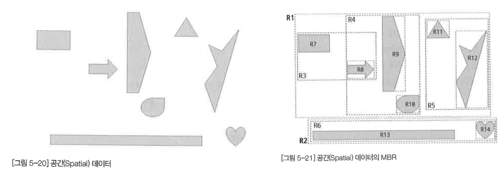
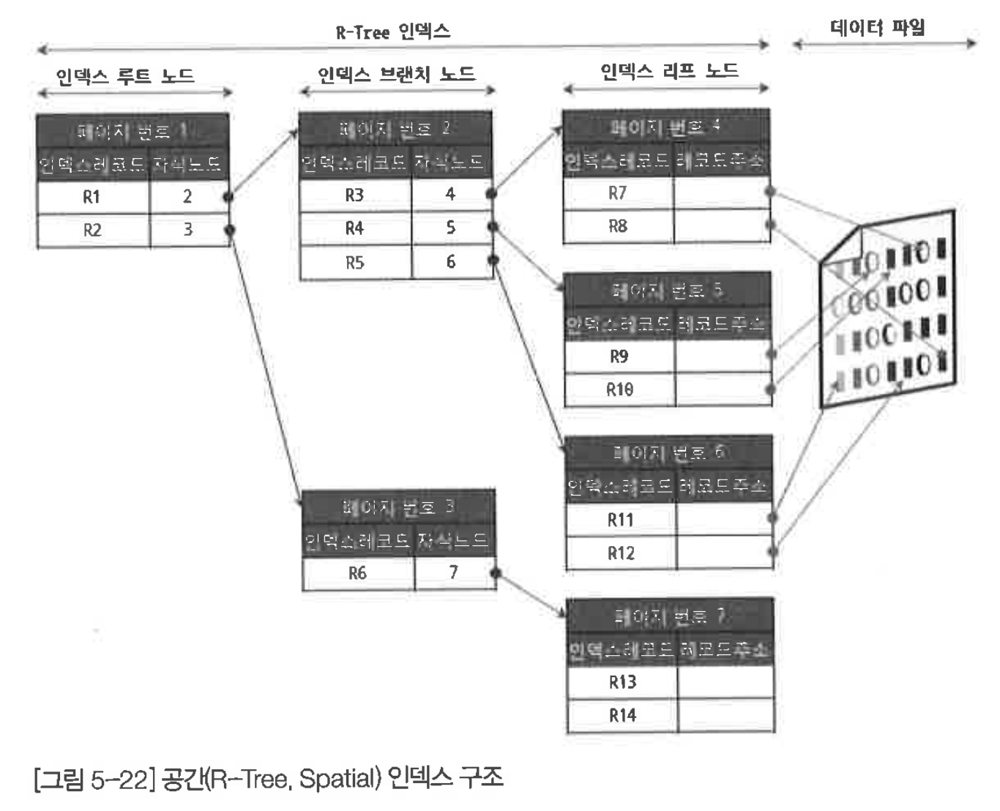
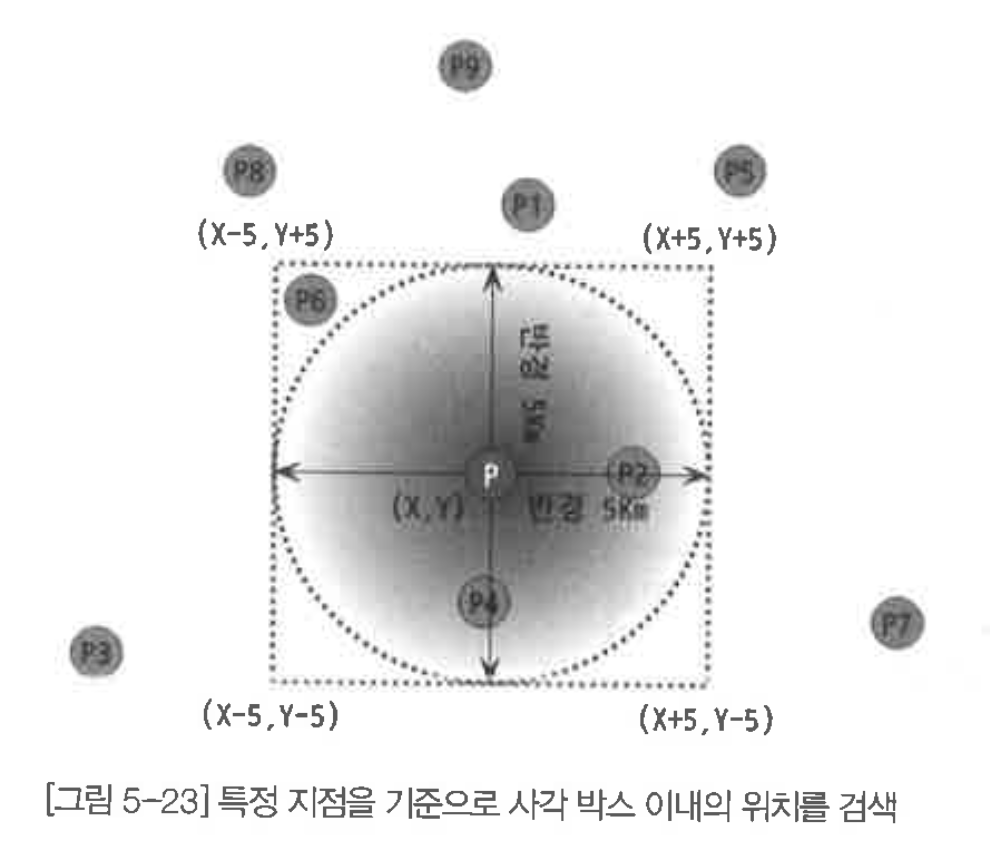
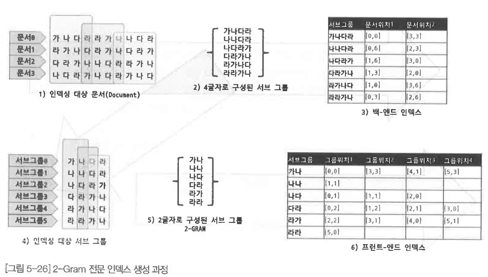
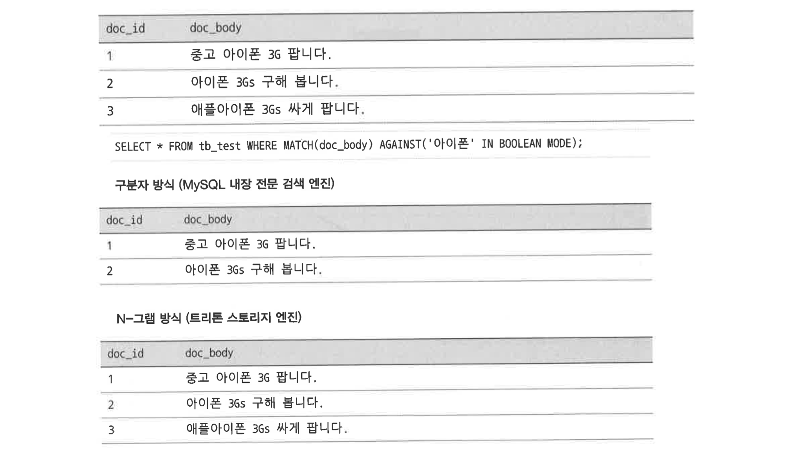
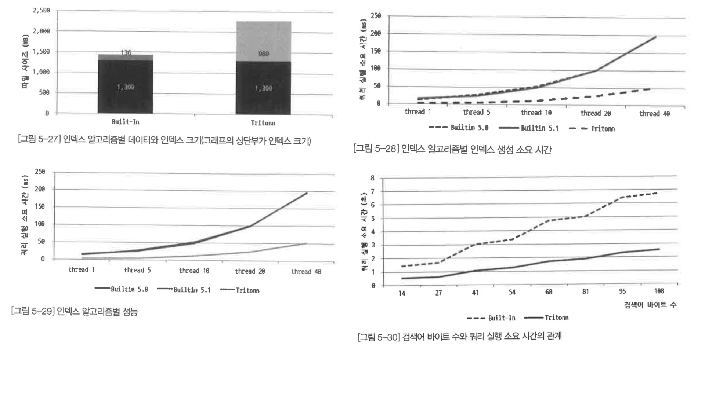
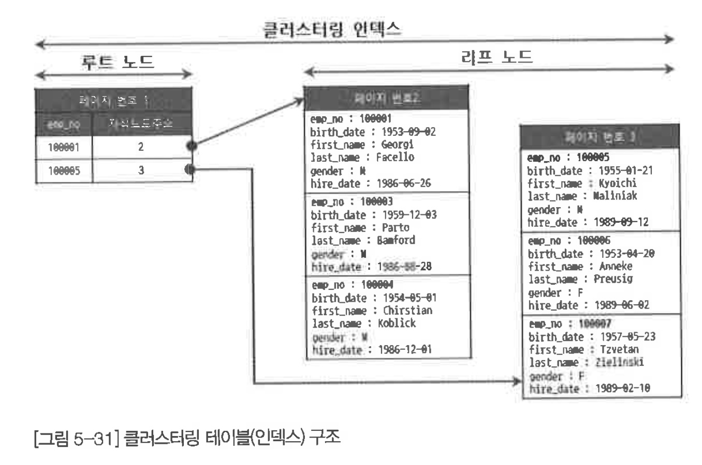
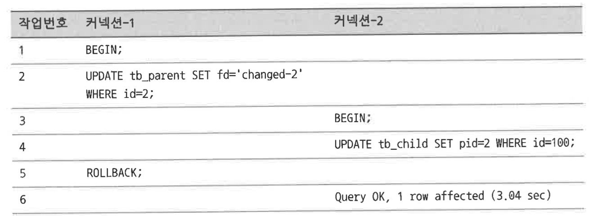
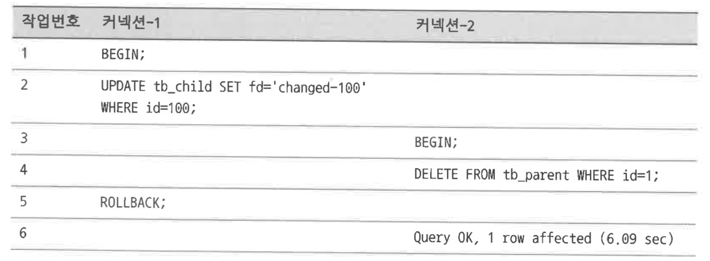

## 5.5 R-Tree 인덱스

---

2차원의 데이터를 인덱싱하고 검색하는 목적의 인덱스다.

내부 메커니즘은 B-Tree와 흡사하다. B-Tree는 인덱스를 구성하는 칼럼의 값이 ```1차원의 스칼라 값``` 인 반면 R-Tree는 ```2차원의 공간 개념 값``` 이다.

위치 기반 서비스를 구현하는 방법: MySQL의 공간 확장(Spatial Extension)을 이용한다.

MySQL의 공간 확장에 포함된 3가지 기능

- 공간 데이터를 저장할 수 있는 데이터 타입
- 공간 데이터의 검색을 위한 공간 인덱스(R-Tree 알고리즘)
- 공간 데이터의 연산 함수(거리 또는 포함 관계의 처리)

### 5.5.1 구조 및 특성

아래와 같은 기하학적 도형의 정보를 관리할 수 있다.


- Geometry: 나머지 3개 타입의 수퍼 타입. point, line, polygon 객체 모두 저장할 수 있다.

R-Tree 알고리즘을 이해하려면 MBR(Minimum Bounding Rectangle) 개념을 알고 있어야 한다. 이 사각형들의 포함 관계를 B-Tree 형태로 구현한 인덱스가 R-Tree 인데스다.

단순히 x좌표와 y좌표만 있는 포인트 데이터 또한 하나의 도형 객체가 될 수 있다.



- 최상위 레벨: R1, R2
- 차상위 레벨: R3, R4, R5, R6
- 최하위 레벨: R7 ~ R14

최하위 레벨의 MBR(각 도형을 제일 안쪽에서 둘러싼 점선 상자)은 각 도형 데이터의 MBR을 의미한다. 그리고 차상위 레벨의 MBR은 중간 크기의 MBR(도형 객체의 그룹)이다. ```최상위 MBR```은 R-Tree의 ```루트 노드```에 저장되는 정보가 되며, ```차상위 그룹 MBR```은 R-Tree의 ```브랜치 노드```가 된다. 마지막으로 각 ```도형의 객체```는 ```리프 노드```에 저장된다.



### 5.5.2 R-Tree 인덱스의 용도

R-Tree 인덱스: Rectangle의 R + B-Tree의 Tree => 공간(Spatial) 인덱스 라고도 한다.

WGS84(GPS) 기준의 위도, 경도 좌표 저장에 주로 사용한다. 좌표 시스템에 기반을 둔 정보에 대해서는 모두 적용할 수 있다.

R-Tree는 도형의 MBR의 포함 관계를 이용해 만들어진 인덱스다. 따라서 Contains() 또는 Intersect() 등과 같은 포함 관계를 비교하는 함수로 검색을 수행하는 경우에만 인덱스를 이용할 수 있다. 현재 출시되는 버전의 MySQL에서는 거리를 비교하는 Distance() 함수를 지원하지 않으므로 Contains()나 Intersect()를 이용해 거리 기반의 비교를 사용한다.



사각 점선의 상자에 포함되는 점들을 검색하면 된다. Contains() 나 Intersect() 연산은 사각형 박스와 같은 다각형(Polygon)으로만 연산할 수 있다. 점 P6은 기준점 P로 부터 반경 5km 이상 떨어져 있지만 최소 사각형 안에는 포함된다. P6을 제거하기 위해서는 조금 더 복잡한 비교가 필요하다.

```sql
SELECT * FROM tb_location
WHERE CONTAINS(px, 사각상자); -- // 공간 좌표 Px가 사각 상자에 포함되는지 비교
```

```sql
SELECT * FROM tb_location
WHERE CONTAINS(px, 사각상자)
AND DISTANCE(p, px) <= 5km; -- // 8장. 확장 검색에서 구현 방법 소개
```

## 5.6 Fractal-Tree 인덱스

---

하드웨어 뿐만 아니라 DBMS의 B-Tree 인덱스 알고리즘 또한 한계에 도달한 것으로 보인다. 이제는 Fractal-Tree가 지금의 데이터에 맞는 인덱스 알고리즘이지 않을까 라는 생각도 든다.

Fractal-Tree는 독점적인 특허로 등록된 알고리즘. TokuTek이라는 회사에서 개발된 MySQL의 스토리지 엔진인 TokuDB에만 적용돼 있다.

### 5.6.1 Fractal-Tree의 특성

B-Tree 인덱스의 가장 큰 문제 -> 디스크의 랜덤 I/O가 상대적으로 많이 필요하다는 것.

Fractal-Tree는 이를 순차 I/O로 변환해서 처리할 수 있다는 것이 가장 큰 장점 -> Fractal-Tree를 스트리밍(Streaming) B-Tree 라고도 한다.

```
랜덤 I/O, 순차 I/O의 차이: 랜덤 I/O는 데이터를 디스크에서 읽을 때 헤드가 여러 군데로 이동해서 떨어져 있는 데이터를 읽어오고
순차 I/O는 디스크의 헤드가 데이터가 있는 곳으로 한 번 이동한 후에 순서대로 데이터를 읽어온다.
```

Fractal-Tree는 인덱스 키가 추가되거나 삭제될 때 B-Tree 인덱스보다 더 많은 정렬 작업이 필요하다. 이 때문에 더 많은 CPU 처리가 필요할지도 모른다. 하지만 인덱스의 단편화가 발생하지 않도록 구성할 수 있고, 인덱스 키값을 클러스터링 하기 때문에 B-Tree 보다는 대용량 테이블에서 높은 성능을 보장한다. B-Tree 인덱스는 일정 수준을 넘어서면 급격한 성능 저하가 발생하는데 Fractal-Tree는 급격한 성능 저하가 없다.

```
인덱스 키값을 클러스터링 한다는 것은 비슷한 값의 키들은 묶어서 저장한다는 뜻이다.
```

에이징(Aging): 오랜 시간 동안 데이터가 변경되면서 단편화가 발생하고 인덱스의 효율이 떨어지는 현상

Fractal-Tree에서는 에이징이 발생하지 않기 때문에 별도의 최적화 작업이 필요하지 않다.

InnoDB의 성능이 급격하게 떨어지는 시기 -> InnoDB 버퍼 풀보다 데이터와 인덱스의 크기가 커지면서 CPU 바운드 작업에서 IO 바운드 작업으로 넘어가는 시점

Fractal-Tree는 출시된 지 얼마 안되서(책이 쓰여진 시점에서) 동시 처리 능력이 InnoDB보다는 훨씬 떨어지는 상태다. -> 이것은 TokuDB 스토리지 엔진의 문제다. 이론적으로 Fractal-Tree가 B-Tree 보다 400배 가량 빠르다.

### 5.6.2 Fractal-Tree의 가용성과 효율성

Fractal-Tree의 장점: B-Tree의 장점을 그대로 갖고 있다. B-Tree로 생성한 인덱스를 Fractal-Tree로 변경해도 동일한 효과를 얻을 수 있다. 따라서 별도의 학습이 필요하지 않다.

어떻게 사용하는가? -> TokuDB 스토리지 엔진으로 테이블을 생성한다.

## 5.7 전문 검색(Full Text Search) 인덱스

---

MySQL의 B-Tree 인덱스는 실제 값이 1MB라 하더라도 전체의 값을 인덱스 키로 사용하지 않는다. 1,000바이트(MyISAM) 또는 767바이트(InnoDB)까지만 잘라서 인덱스 키로 사용한다. 전체 일치 또는 좌측 일부 일치와 같은 검색만 가능하다.

전문(Full Text) 검색에는 InnoDB나 MyISAM 스토리지 엔진에서 제공하는 일반적인 용도의 B-Tree 인덱스를 사용할 수 없다. 문서 전체에 대한 분석과 검색을 위한 이러한 인덱싱 알고리즘을 전문 검색(Full Text Search) 인덱스 라고 한다. 문서의 키워드를 인덱싱하는 기법에 따라 크게 구분자(Stopword)와 N-그램으로 나눠서 생각해 볼 수 있다.

### 5.7.1 인덱스 알고리즘

문서 본문의 내용에서 사용자가 검색하게 될 키워드를 분석해 내고, 빠른 검색용으로 사용할 수 있게 이러한 키워드로 인덱스를 구축한다. MySQL 모든 버전에서 기본적으로 제공하는 전문 검색 엔진의 인덱스 방식인 ```구분자```와 MySQL이 아닌 ```서드파티에서 제공하는(플러그인 형태로 적용)``` 전문 검색 기능에서 주로 제공하는 ```N-그램``` 방식에 대해 살펴본다.

**구분자(Stopword) 기법**

공백, 탭(띄어쓰기), 마침표와 같은 문장 기호, 그리고 사용자가 정의한 문자열을 구분자로 등록한다. 등록된 구분자를 이용해 키워드를 분석해내고, 결과 단어를 인덱스로 생성해 두고 검색에 이용하는 방법이다. 일반적으로 ```공백, 쉼표 또는 한국어의 조사``` 등을 구분자로 많이 사용한다. MySQL의 내장 전문 검색 엔진은 구분자 방식으로만 인덱싱 할 수 있다.

구분자 기법은 문서의 본문으로부터 키워드를 추출해 내는 작업이 추가로 필요할 뿐 내부적으로는 B-Tree 인덱스를 그대로 사용한다. -> 해당 인덱스로 조회하는 레코드는 정렬되어 조회되지 않는다. 전문 검색에서 결과의 정렬은 ```일치율(Match percent)```이 높은 순으로 출력되는 것이 일반적이다.

```
문장 기호뿐 아니라 특정 단어를 일부러 구분자로 등록할 수 있다. 모든 레코드에 포함되는 값을 특정 단어로 등록할 시 검색의 효과가 없어진다.
```

**N-그램(n-Gram) 기법**

다양한 언어에 하나의 규칙을 적용해 키워드를 추출해내기란 쉽지 않다. 지정된 규칙이 없는 전문도 분석 및 검색을 가능하게 하는 방법이 N-그램이라는 방식이다.

N-그램이란 본문을 ```무조건 몇 글자씩 잘라서 인덱싱```하는 방법이다. 인덱싱 알고리즘이 복잡하고 인덱스의 크기도 상당히 큰 편이다. n은 인덱싱할 키워드의 최소 글자(또는 바이트) 수를 의미한다. 일반적으로 2글자 단위로 키워드를 쪼개서 인덱싱하는 2-Gram(Bi-Gram) 방식이 많이 사용된다.

2-Gram 인덱싱 기법은 2글자 단위의 최소 키워드에 대한 키를 관리하는 ```프론트엔드 인덱스```와 2글자 이상의 키워드 묶음(n-SubSequence Window)을 관리하는 ```백엔드 인덱스``` 2개로 구성된다.

- 문서의 본문을 2글자보다 큰 크기로 블록을 구분해서 백엔드 인덱스(3)를 생성
- 백엔드 인덱스의 키워드들을 2글자씩 잘라서 프론트엔드 인덱스(6)를 생성



인덱스의 검색 과정은 전문 인덱스의 생성과는 반대로 입력된 검색어를 2바이트 단위로 동일하게 잘라서 프론트엔드 인덱스를 검색한다. 그 결과를 대상 후보군으로 선정하고 백엔드 인덱스를 통해 최종 검증을 거쳐 일치하는 결과를 가져온다.

### 5.7.2 구분자와 N-그램의 차이

가장 큰 차이는 **검색 결과**



구분자 방식의 검색에는 검색어 앞에 다른 단어가 붙어 있으면 찾을 수 없다 -> 쇼핑몰과 같은 웹 서비스에서 상품의 이름을 검색할 때 상당한 제한 사항이 될 수도 있다.

성능과 인덱스의 크기를 비교해보자. N-그램 전문 검색 인덱스는 구분자 방식보다 인덱스의 크기가 크다는 것이다. 또한 인덱스를 생성하는 과정이 복잡하므로 전문 인덱스에 키워드를 추가하거나 삭제하는 데 시간도 많이 걸린다. 하지만 전문 검색을 수행하는 데 걸리는 시간은 더 빠르며 클라이언트의 동시 실행 쿼리 수가 많아질수록 그 차이는 더 벌어진다. 전문 검색 인덱스는 모두 검색어의 길이(바이트 수)가 길어질수록 많은 성능 저하가 발생한다. MySQL의 빌트인 전문 검색은 검색어의 길이가 길어질수록 쿼리의 성능이 더 심하게 느려진다.



### 5.7.3 전문 검색 인덱스의 가용성

전문 검색 인덱스를 사용하려면 그에 맞는 구문을 사용해야 한다. 아래 구문은 전문 검색 인덱스를 사용하지 않고 풀 테이블 스캔으로 처리한다.

```sql
SELECT * FROM tb_test WHERE doc_bocy LIKE '%애플%';
```

전문 검색 인덱스를 사용하려면 반드시 MATCH(...) 또는 AGAINST(...) 구문으로 검색 쿼리를 작성해야 하며 MATCH 절의 괄호에 포함되는 내용은 반드시 사용할 전문 검색 ```인덱스에 정의된 칼럼이 모두 명시```돼야 한다.

## 5.8 비트맵 인덱스와 함수 기반 인덱스

---

MySQL 스토리지 엔진 가운데 비트맵 인덱스와 함수 기반(Functional based) 인덱스를 지원하는 스토리지 엔진은 없다. 비트맵 인덱스에 대한 대안은 없지만 함수 기반의 인덱스는 쉽게 우회해서 구현할 수 있다.

함수 기반의 인덱스: 테이블에 함수의 결과값을 저장하는 칼럼을 추가하고 그 칼럼에 인덱스를 생성한다. 실제로 길이가 상당히 긴 칼럼에 대한 동등 비교 검색을 위해서는 문자열의 해시 값을 생성해서 별도의 칼럼에 저장하고 해당 칼럼에 인덱스를 생성하는 방식을 많이 사용한다.

## 5.9 클러스터링 인덱스

---

클러스터: 여러 개를 하나로 묶는다.

인덱스에서 클러스터링: 값이 비슷한 것들을 묶어서 저장하는 형태로 구현한다. -> 비슷한 값들은 동시에 조회하는 경우가 많다는 점에서 착안했다.

MySQL에서 클러스터링 인덱스는 InnoDB와 TokuDB 스토리지 엔진에서만 지원한다.

### 5.9.1 클러스터링 인덱스

테이블의 프라이머리 키에 대해서만 적용되는 내용. 프라이머리 키값이 비슷한 레코드끼리 묶어서 저장하는 것을 클러스터링 인덱스라고 표현한다.

프라이머리 키값에 의해 레코드의 저장 위치가 결정된다. 프라이머리 키값이 변경된다면 레코드의 물리적인 저장 위치가 바뀌어야 한다는 것이다. 프라이머리 키값으로 클러스터링된 테이블은 프라이머리 키값 자체에 대한 의존도가 상당히 크기 때문에 신중히 프라이머리 키값을 결정해야 한다.

클러스터링 인덱스 === 클러스터 테이블

클러스터링의 기준 -> 프라이머리 키 -> 클러스터 키

InnoDB와 같이 항상 클러스터링 인덱스로 저장되는 테이블은 프라이머리 키 기반의 검색이 매우 빠르며 대신 레코드의 저장이나 프라이머리 키의 변경이 상대적으로 느릴 수 밖에 없다.

```
B-Tree 인덱스도 인덱스도 키값으로 이미 정렬되어 있다. 일반적인 B-Tree 인덱스를 클러스터링 인덱스라고 부르지 않는다.
테이블의 레코드가 프라이머리 키값으로 정렬되어 저장된 경우만을 '클러스터링 인덱스' 또는 '클러스터링 테이블'이라 한다.
```



클러스터링 테이블의 구조 자체는 일반 B-Tree와 많이 비슷하게 닮아 있다. 클러스터링 인덱스의 리프 노드에는 레코드의 모든 칼럼이 같이 저장돼 있음을 알 수 있다. 클러스터링 테이블은 그 자체가 하나의 거대한 인덱스 구조로 관리되는 것이다.

```sql
UPDATE tb_test SET emp_no = 10002 WHERE emp_no = 10007;
```

위 쿼리가 실행되면 emp_no가 10002로 변경되면서 2번 페이지로 이동한다.

```
InnoDB를 제외한 테이블의 데이터 레코드는 프라이머리 키나 인덱스 키값이 변경된다고 해서 실제 데이터 레코드의 위치가 변경되지 않는다.
데이터 레코드가 INSERT될 때 데이터 파일의 끝(또는 임의의 빈 공간)에 저장된다.
한번 결정된 위치는 절대 바뀌지 않고, 레코드가 저장된 주소는 MySQL 내부적으로 레코드를 식별하는 아이디로 인식된다.
레코드가 저장된 주소를 로우 아이디(ROW-ID)라고 표현한다. 일부 DBMS에서는 이 값을 사용자가 직접 조회하거나 쿼리의 조건으로 사용할 수 있다.
MySQL에서는 사용자에게 노출되지 않는다.
```

InnoDB 테이블에서 프라이머리 키가 없는 경우 아래 우선순위로 프라이머리 키를 대체할 칼럼을 선택한다.

1. 프라이머리 키가 있으면 기본적으로 프라이머리 키를 클러스터 키로 선택
2. NOT NULL 옵션의 유니크 인덱스(UNIQUE INDEX) 중에서 첫 번째 인덱스를 클러스터 키로 선택
3. 자동으로 유니크한 값을 가지도록 증가되는 칼럼을 내부적으로 추가한 후, 클러스터 키로 선택

InnoDB 스토리지 엔진이 내부적으로 자동 증가 칼럼을 추가한 경우, 자동 추가된 칼럼은 사용자에게 노출되지 않으며, 쿼리 문장에 명시적으로 사용할 수 없다. 이것은 아무런 의미 없는 숫자 값으로 클러스터링이 되고 있는 것이며, 아무런 혜택을 주지 않는다. InnoDB 프라이머리 키는 클러스터링 인덱스의 기준이 된다. 클러스터링 인덱스는 단 한 번만 가질 수 있는 엄청난 혜택이므로 가능하다면 프라이머리 키를 명시하자.

### 5.9.2 보조 인덱스(Secondary Index)에 미치는 영향

MyISAM이나 MEMORY 테이블과 같은 클러스터링되지 않은 테이블은 INSERT 될 때 한번 저장된 공간에서 절대 이동하지 않는다. 데이터 레코드가 저장된 주소는 내부적인 레코드 아이디(ROW-ID) 역할을 한다. 프라이머리 키나 보조 인덱스의 각 키는 그 주소(ROW-ID)를 이용해 실제 데이터 레코드를 찾아온다. **MyISAM 테이블이나 MEMORY 테이블에서는 프라이머리 키와 보조 인덱스는 구조적으로 아무런 차이가 없다.**

InnoDB 테이블에서는 클러스터 키값이 변경될 때마다 데이터 레코드의 주소가 변경되고 그때마다 해당 테이블의 모든 인덱스에 저장된 주소 값을 변경해야 할 것이다. 이런 번거로움을 방지하고자 InnoDB 테이블(클러스터 테이블)의 모든 보조 인덱스는 해당 레코드가 저장된 주소가 아니라 프라이머리 키값을 저장하도록 구현돼 있다.

```sql
CREATE TABLE employees (
	emp_no INT NOT NULL,
  first_name VARCHAR(20) NOT NULL,
  PRIMARY KEY (emp_no),
  INDEX ix_firstname (first_name)
);

SELECT * FROM employees WHERE first_name = 'Aamer';
```

**MyISAM**

ix_firstname 인덱스를 검색해서 레코드의 ```주소를 확인``` -> 레코드의 주소를 이용해 최종 레코드를 가져 옴

**InnoDB**

ix_firstname 인덱스를 검색해 레코드의 ```프라이머리 키값```을 확인 -> 프라이머리 키값을 이용해 ```다시 한번 테이블을 검색```한 후 최종 레코드를 가져 옴(매우 빠르게 처리되므로 성능을 걱정할 필요는 없다.)

### 5.9.3 클러스터 인덱스의 장점과 단점

일반 클러스터 되지 않은 일반 프라이머리 키와 클러스터 인덱스를 비교했을 때의 상대적인 장단점을 정리해 보자.

**장점**

- 프라이머리 키(클러스터 키)로 검색할 때 처리 성능이 매우 빠름(특히, 프라이머리 키를 범위 검색하는 경우 매우 빠름)
- 테이블의 모든 보조 인덱스가 프라이머리 키를 가지고 있기 때문에 인덱스만으로 처리될 수 있는 경우가 많음(이를 ```커버링 인덱스```라고 한다.)

**단점**

- 테이블의 모든 보조 인덱스가 클러스터 키를 갖기 때문에 클러스터 키값의 크기가 클 경우 전체적으로 ```인덱스의 크기가 커짐```
- 보조 인덱스를 통해 검색할 때 ```프라이머리 키로 다시 한번 검색```해야 하므로 처리 성능이 조금 느림
- ```INSERT``` 할 때 ```프라이머리 키에 의해 레코드의 저장 위치가 결정```되기 때문에 처리 성능이 조금 느림
- ```프라이머리 키를 변경```할 때 레코드를 ```DELETE 하고 INSERT 하는 작업```이 필요하기 때문에 처리 성능이 느림

### 5.9.4 클러스터 테이블 사용 시 주의사항

InnoDB(클러스터 테이블) 사용 시 주의사항

**클러스터 인덱스 키의 크기**

모든 보조 인덱스가 프라이머리 키(클러스터 키)값을 포함한다. 프라이머리 키의 값이 커지면 보조 인덱스도 자동으로 크기가 커진다. 인덱스가 커질수록 같은 성능을 내기 위해 그만큼의 메모리가 더 필요하다. InnoDB의 프라이머리 키는 신중하게 선택해야 한다.

**프라이머리 키는 AUTO-INCREMENT 보다는 업무적인 칼럼으로 생성할 것(가능한 경우)**

InnoDB의 프라이머리 키는 클러스터 키로 사용되며 이 값에 의해 레코드의 위치가 결정된다. 프라이머리 키로 겁색하는 경우(범위로 많은 레코드를 검색하는 경우) 클러스터되지 않은 테이블에 비해 매우 빠르게 처리될 수 있음을 의미한다. 프라이머리 키는 대부분 검색에서 상당히 빈번하게 사용되는 것이 일반적이다. 업무적으로 해당 레코드를 대표할 수 있다면 그 칼럼을 프라이머리 키로 설정하는 것이 좋다.

**프라이머리 키는 반드시 명시할 것**

프라이머리 키는 설정할 것을 권장한다. InnoDB 테이블에서 프라이머리 키를 정의하지 않으면 자동 증가 칼럼을 내부적으로 추가한다. 자동으로 추가된 칼럼은 사용자에게 보이지 않기 때문에 SQL에서 전혀 사용할 수가 없다.

**AUTO-INCREMENT 칼럼을 인조 식별자로 사용한 경우**

복합으로 프라이머리 키가 만들어지는 경우 프라이머리 키의 크기가 길어질 때가 가끔 있다. 보조 인덱스가 필요하지 않다면 그대로 프라이머리 키를 사용하는 것이 좋다. 보조 인덱스도 필요하고 프라이머리 키의 크기도 길다면 AUTO-INCREMENT 칼럼을 추가하고, 프라이머리 키로 설정한다. 인위적으로 추가된 프라이머리 키를 인조 식별자(Surrogate key)라고 한다. 로그 테이블과 같이 조회보다는 INSERT 위주의 테이블들은 AUTO-INCREMENT를 이용한 인조 식별자를 프라이머리 키로 설정하는 것이 성능 향상에 도움이 된다.

## 5.10 유니크 인덱스

---

유니크는 인덱스라기 보다는 제약 조건에 가깝다. 테이블이나 인덱스에 같은 값이 2개 이상 저장될 수 없음을 의미한다. MySQL에서는 인덱스 없이 유니크 제약만 설정할 방법이 없다. 유니크 인덱스에는 NULL도 저장될 수 있는데, NULL은 특정의 값이 아니므로 2개 이상 저장될 수 있다. MySQL에서 프라이머리 키는 기본적으로 NULL을 허용하지 않는 유니크 속성이 자동으로 부여된다. MyISAM 이나 MEMORY 테이블에서 프라이머리 키는 사실 NULL이 허용되지 않는 유니크 인덱스와 같지만 InnoDB 테이블의 프라이머리 키는 클러스터 키의 역할도 하므로 유니크 인덱스와는 근본적으로 다르다.

### 5.10.1 유니크 인덱스와 일반 보조 인덱스의 비교

유니크 인덱스와 일반 보조 인덱스는 사실 인덱스의 구조상 아무런 차이점이 없다.

**인덱스 읽기**

보조 인덱스의 읽기 작업은 디스크 읽기가 아니라 CPU에서 칼럼값을 비교하는 작업이기 때문에 이는 성능상의 영향이 거의 없다고 볼 수 있다. 유니크하지 않은 보조 인덱스는 중복된 값이 허용되므로 읽어야할 레코드가 많아서 느린 것이지, 인덱스 자체의 특성 때문에 느린 것이 아니란 것이다. 하나의 값을 검색하는 경우, 유니크 인덱스와 일반 보조 인덱스는 사용되는 실행 계획이 다르다. 인덱스의 성격이 유니크한지 아닌지에 따른 차이일 뿐 큰 차이는 없다.

**인덱스 쓰기**

유니크 인덱스의 키값을 쓸 때는 중복된 값이 있는지 없는지 체크하는 과정이 한 단계 더 필요하다. 일반 보조 인덱스의 쓰기보다 느리다. MySQL에서는 유니크 인덱스에서 중복된 값을 체크할 때는 읽기 잠금을 사용하고 쓰기를 할 때는 쓰기 잠금을 사용하는데 이 과정에서 데드락이 아주 빈번히 발생한다. InnoDB 스토리지 엔진에는 인덱스 키의 저장을 버퍼링하기 위해 인서트 버퍼(Insert Buffer)가 사용된다. 유니크 인덱스는 반드시 중복 체크를 해야 하므로 작업 자체를 버퍼링하지 못한다. 이 때문에 유니크 인덱스는 일반 보조 인덱스보다 더 느려진다.

### 5.10.2 유니크 인덱스 사용 시 주의사항

불필요하게 유니크 인덱스를 생성하지 않는 편이 좋다. MySQL의 유니크 인덱스는 일반 다른 인덱스와 같은 역할을 하므로 중복해서 인덱스를 생성할 필요는 없다. 유니크 인덱스도 일반 보조 인덱스와 같은 역할을 동일하게 수행할 수 있으므로 중복해서 보조 인덱스를 만들어 줄 필요는 없다. 프라이머리 키와 유니크 인덱스를 동일하게 생성하는 것도 불필요한 중복이다. 유니크 인덱스는 쿼리의 실행 계획이나 테이블의 파티셔닝에 미치는 영향이 있다.(6장 '실행 계획', 10장 '파티션') 결론적으로 유일성이 꼭 보장돼야 하는 칼럼에 대해서는 유니크 인덱스를 생성하되, 꼭 필요하지 않다면 유니크 인덱스보다는 유니크하지 않은 보조 인덱스를 생성하는 방법도 한 번씩 고려해 본다.

## 5.11 외래키

---

MySQL에서 외래키는 InnoDB 스토리지 엔진에서만 생성할 수 있으며 외래키 제약이 설정되면 자동으로 연관되는 테이블의 칼럼에 인덱스까지 생성된다. 외래키가 제거되지 않은 상태에서는 자동으로 생성된 인덱스를 삭제할 수 없다.

InnoDB 외래키 관리의 중요한 두 가지 특징

- 테입르의 변경(쓰기/잠금)이 발생하는 경우에만 잠금 경합(잠금 대기)이 발생한다.
- 외래키와 연관되지 않은 칼럼의 변경은 최대한 잠금 경합(잠금 ㄷ0기)을 발생시키지 않는다.

예시 테이블

```sql
CREATE TABLE tb_parent (
	id INT NOT NULL,
  fd VARCHAR(100) NOT NULL,
  PRIMARY KEY (id)
) ENGINE=INNODB;

CREATE TABLE tb_child (
	id INT NOT NULL,
  pid INT DEFAULT NULL, -- // parent.id 칼럼 참조
  fd VARCHAR(100) DEFAULT NULL,
  PRIMARY KEY (id),
  KEY ix_parentid (pid),
  CONSTRAINT child_ibfk_1 FOREIGN KEY (pid) REFERENCES tb_parent (id) ON DELETE CASCADE
) ENGINE=INNODB;
```

### 5.11.1 자식 테이블의 변경이 대기하는 경우



1번 커넥션이 tb_parent 테이블에서 id=2인 레코드에 대해 쓰기 잠금을 획득 -> 작업번호 4는 부모 테이블의 변경 작업이 완료될 때 까지 대기 -> 작업번호 5가 실행되면 트랜잭션을 종료하므로 2번 커넥션의 대기 중이던 작업이 즉시 처리된다.

자식 테이블의 외래 키 칼럼의 변경(INSERT, UPDATE)은 부모 테이블의 확인이 필요한데, 이 상태에서 부모 테이블의 해당 레코드가 쓰기 잠금이 걸려 있으면 해당 쓰기 잠금이 해제될 때까지 기다리게 되는 것이다. -> InnoDB의 외래키 관리의 첫 번째 특징

외래키(pid)가 아닌 칼럼의 변경은 외래키로 인한 잠금 확장이 발생하지 않는다. -> InnoDB의 외래키의 두 번째 특징

### 5.11.2 부모 테이블의 변경 작업이 대기하는 경우



부모 키 1을 참조하는 자식 테이블의 레코드를 변경 -> tb_child 테이블의 레코드에 대해 쓰기 잠금을 획득 -> 2번 커넥션에서 tb_parent 테이블의 레코드를 삭제하려면 쓰기 잠금이 해제될 때까지 기다려야 한다 -> 자식 테이블이 생성될 때 정의된 외래키의 특성(ON DELETE CASCADE) 때문에 부모 레코드가 삭제되면서 자식 레코드도 동시에 삭제되도록 작동하기 때문이다.

데이터베이스에서 외래 키를 물리적으로 생성하려면 잠금 경합까지 고려해 개발을 진행하는 것이 좋다. 물리적으로 외래키를 생성하면 자식 테이블에 레코드가 추가되는 경우 해당 참조키가 부모 테이블에 있는지 확인한다. 이런 체크를 위해 연관 테이블에 읽기 잠금을 걸어야 한다는 것이다. 이렇게 잠금이 다른 테이블로 확장되면 그만큼 전체적으로 쿼리의 동시 처리에 영향을 미친다.

## 5.12 기타 주의사항

---

**스토리지 엔진별 지원 인덱스 목록**

인덱스는 MySQL 엔진 레벨이 아니라 스토리지 엔진 레벨에 포함되는 영역이다.


**analyze와 optimize의 필요성**

MyISAM이나 InnoDB 테이블의 경우 인덱스에 대한 통계 정보를 관리하고 통계 정보를 기반으로 쿼리의 실행 계획을 수립한다.


가장 중요한 칼럼은 Cardinality 항목이다. Cardinality에 의존해서 실행 계획을 수립한다.

MySQL의 인덱스 통계 정보에서 기억해야 할 점은 사용자나 DB 관리자도 모르는 사이에 통계 정보가 상당히 자주 업데이트 된다는 것이다. MySQL 서버가 테이블을 처음으로 열거나 대량의 데이터 변경 또는 테이블의 구조 변경(DDL)이 실행되면 통계 정보를 자동으로 갱신한다.

가끔은 쿼리의 실행 계획이 의도했던 것과는 너무 다르게 만들어질 때가 있다. 이런 경우는 인덱스의 통계 정보가 실제와는 너무 다르게 수집되어 MySQL이 실행 계획을 엉뚱하게 만들어 버리게 되는 것이다. 이런 경우에는 ANALYZE 명령으로 통계 정보를 다시 수집해 보는 것이 좋다.

- 테이블의 데이터가 별로 없는 경우(주로 개발용 데이터베이스)
- 단시간에 대량의 데이터가 늘어나거나 줄어드는 경우