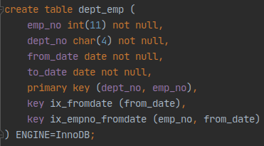

# 6.2.5 ~ 6.2.13

# 6.2.5 possible_keys

사용될 법 했던 인덱스의 목록이다. 거의 모든 인덱스가 포함되는 경우가 허다하며 쿼리 튜닝에 도움이 되지 않는 칼럼이다. possible_keys 칼럼에 인덱스 이름이 나열되었다고 그 인덱스를 사용한다고 판단하지 않도록 주의하자

# 6.2.6 key

실제로 실행계획에서 사용되는 인덱스를 의미한다. 

표시되는 값이 PRIMARY일 경우에는 프라이머리 키를 사용한다는 의미이며, 그 외의 값은 모두 테이블이나 인덱스를 생성할 때 부여했던 고유 이름이다.(MySQL에서 프라이머리 키는 별도의 이름을 부여할 수 없다)

type이 ALL일 때와 같이 인덱스를 전혀 사용하지 못하면 NULL로 표시된다

# 6.2.7 key_len

무시되기 쉽지만 매우 중요한 정보이다. 실제 사용할 때 단일 칼럼으로만 만들어진 인덱스보다 다중 칼럼으로 만들어진 인덱스가 더 많다. 

key_len은 다중 칼럼으로 구성된 인덱스에서 몇 개의 칼럼까지 사용했는지를 나타낸다. 정확히는 인덱스의 각 레코드에서 몇 바이트까지 사용했는지 알려주는 값이다.

그래서 다중 칼럼 인덱스뿐 아니라 단일 칼럼으로 만들어진 인덱스에서도 같은 지표를 제공한다

## 예제

dept_emp 테이블이 다음과 같을 때



- 예제1

    ```
    explain
    select * from dept_emp where dept_no='d005';
    ```

    

    (dept_no + emp_no)의 두 개의 칼럼으로 만들어진 PRIMARY 키를 포함한 테이블을 조회했다. 그런데 dept_no만 사용하고 있으므로 dept_no의 크기만큼 key_len 값이 12로 표시되었다

    (MySQL은 utf8문자 하나당 3바이트를 할당하며 dept_no는 CHAR(4)이기 때문에 12)

- 예제2

    ```
    explain
    select * from dept_emp where dept_no='d005' and emp_no=10001;
    ```

    

    이번에는 dept_no와 emp_no 모두를 사용하고 있다.

     emp_no는 INTEGER이며 4바이트를 차지하고 있으며 이번에는 이 값을 더한 16바이트를 차지한다

## 버전별 주의점

5.1버전부터 MySQL 엔진과 InnoDB 스토리지 엔진의 역할 분담에 큰 변화가 생겼다. 

5.0에서는 범위 제한 조건으로 사용되는 칼럼만 스토리지 엔진으로 전달했지만, 5.1부터는조건에 관계없이 인덱스를 사용할 수 있다면 모두 스토리지 엔진으로 전달한다.

1. 5.0이하

    위 예제2를 실행해보면 key_len 값이 12로 바뀐다. key_len에 표시되는 값은 인덱스를 이용해 범위를 제한하는 조건의 칼럼까지만 포함한다. 단순히 체크 조건으로 사용된 칼럼은 key_len에 포함되지 않는다.

2. 5.1 이상

    예제2를 실행해보면 key_len 값이 16으로 표시된다. 

# 6.2.8 ref

접근 방법이 ref 방식이면 참조 조건으로 어떤 값이 제공되었는지 보여준다.

상수 값이라면 const, 다른 테이블의 칼럼 값이면 테이블 명과 칼럼 명이 표시된다.

크게 신경 쓸 필요는 없지만 func이 표시될 때는 조금 주의해서 볼 필요가 있다. 이는 값이 그대로 사용되지 않고 연산을 거쳐서 참조되었음을 의미한다. 사용자가 명시적으로 값을 변환할 때뿐만 아니라, MySQL 서버가 내부적으로 값을 변환해야 할 때도 func이 출력된다. 조인 칼럼의 타입이 일치하지 않아 변환이 일어날 때도 func가 출력된다.

# 6.2.9 rows

실행계획의 효율성 판단을 위해 예측했던 레코드 건수를 보여준다. 스토리지 엔진별로 가지고 있는 통계정보를 참조해 산출한 예상 값이라 정확하지는 않다.

반환 값은 레코드의 예측치가 아니라 쿼리를 처리하기 위해 얼마나 많은 레코드를 읽고 체크해야 하는지를 의미한다.

# 6.2.10 Extra

고정된 몇 개의 문장이 표시되는데 일반적으로 2~3개씩 같이 표시된다.

표시될 수 있는 문장을 하나씩 자세히 잘펴보자. 순서는 성능과는 무관하다

## const row not found (5.1부터)

쿼리의 실행 계획에서 const 접근 방식으로 테이블을 읽었지만 실제로 해당 테이블에 레코드가 한 건도 존재하지 않은 경우 표시된다.

## Distinct

쿼리의 distinct를 처리하기 위해 조인하지 않아도 되는 항목은 모두 무시하고 꼭 필요한 것만 조인했으며 꼭 필요한 레코드만 읽었다는 것을 표현한다.

## Full scan on NULL key

col1 IN (SELECT col2 FROM ...)과 같은 쿼리에서 col1이 NOT NULL이 아니면 표시된다.

SQL 표준에서는 NULL을 알 수 없는 값으로 정의하고 있으며, NULL에 대한 연산의 규칙을 정의하고 있다. 

그 규칙을 따를 때 위 쿼리는 다음과 같이 비교된다

- 서브 쿼리가 1건이라도 결과 레코드를 가진다면 최종 비교 결과는 NULL
- 서브 쿼리가 1건이라도 결과 레코드를 가지지 않는다면 최종 비교 결과는 FALSE

이는 풀 테이블 스캔을 해야만 결과를 구할 수 있기 때문에 FULL scan on NULL key라는 이름을 가진다.

## Impossible HAVING (5.1부터)

쿼리에 사용된 HAVING 절의 조건을 만족하는 레코드가 없을 때 표시된다.

이 메시지가 출력된다면 쿼리가 제대로 작성되지 못한 경우가 대부분이므로 점검하는 것이 좋다.

## Impossible WHERE(5.1부터)

WHERE 조건이 항상 FALSE가 될 수밖에 없는 경우 표시된다.

실제로 실행되지 않으면 where 조건에 해당하는 레코드가 있는지 없는지 판단 할 수 없는 경우가 있다. 이 때도 Impossible WHERE는 표시되는데 MySQL이 실행 계획을 만드는 과정에서 쿼리의 일부분을 실행해본다는 것을 알 수 있다.

## No matching min/max row(5.1부터)

MIN()이나 MAX()와 같은 집합 함수가 있는 쿼리의 조건절에 일치하는 레코드가 없을 경우 표시된다.

그리고 MIN()이나 MAX()의 결과로 NULL이 반환된다.

## no matching row in const table(5.1부터)

조인에 사용된 테이블에서 const 방식으로 접근할 때 일치하는 레코드가 없을 경우 표시된다.

## No tables used(5.0의 No tables)

From 절이 없는 쿼리 문장이나 FROM DUAL 형태의 쿼리 실행 계획에서 표시된다.

(다른 DBMS와 달리 MySQL은 FROM 절이 없는 쿼리도 허용된다)

## Not exists

아우터 조인을 이용해 안티 조인을 수행하는 경우 표시된다.

A테이블에는 존재하지만 B테이블에는 없는 값을 조회하는 경우를 안티 조인이라 한다.

(이때 주로 NOT IN이나 NOT EXISTS를 사용한다)

레코드의 수가 많을 때 아우터 조인을 이용하면 같은 작업을 더 빠르게 할 수 있다.

- 예시

    ```
    explain
    select *
    from dept_emp de
        left join departments d on de.dept_no = d.dept_no
    where d.dept_no IS NULL;
    ```

    

## Range checked for each record (index map: N)

매 레코드마다 인덱스 레인지 스캔을 체크해야 할 때 표시된다.

index map: N 의 값은 후보 인덱스의 순번을 나타낸다.(16진수)

조인 조건에 상수가 없고 둘 다 변수인 경우

레코드를 하나 읽을 때마다 값이 바뀌어 쿼리의 비용 계산을 위한 기준 값이 계속 변하여

어떤 접근 방법으로 테이블을 읽는 것이 좋을 지 MySQL 옵티마이저가 판단할 수 없을 수 있다.

- 예시

    ```
    explain
    select *
    from employees e1, employees e2
    where e2.emp_no >= e1.emp_no;
    ```

    

    e1.emp_no = 1일 때,  e2 테이블의 전부를 읽어야 해 풀 테이블 스캔이 좋고

    e1.emp_no = 10001일 때, e2 테이블의 한 건만 읽어도 되 인덱스 레인지 스캔이 좋다.

    index map의 값은 1인데, e2 테이블의 첫 번째 인덱스를 사용할지 아니면 풀 테이블 스캔을 할지를 매번 판단한다는 것을 의미한다.

    여기서 type이 ALL임은 무조건 풀 테이블 스캔으로 처리되었음을 의미하지 않는다. 최종적으로 풀 테이블 스캔을 이용할 수 있기 때문에 ALL이 표시된 것이다.

## Scanned N database(5.1부터)

MySQL 5.0부터 INFORMATION_SCHEMA라는 DB가 제공되어 DB의 메타정보를 저장한다.

5.1부터 이를 빠르게 조회할 수 있도록 개선되었으며 개선된 조회를 통해 메타 정보를 검색하는 경우 표시된다.

실제로 사용하는 일은 거의 없다.

N은 몇 개의 DB 정보를 읽었는지 보여주며 0, 1, all의 값을 가질 수 있다

- 0: 특정 테이블의 정보만 요청되어 데이터베이스 전체의 메타정보를 읽지 않음
- 1: 특정 DB의 모든 스키마 정보가 요청되어 해당 DB의 모든 스키마 정보를 읽음
- all: MySQL 서버 내의 모든 스키마 정보를 다 읽음
- 예시

    ```
    explain
    select table_name
    from information_schema.tables
    where TABLE_SCHEMA = 'employees' and table_name = 'employees';
    ```

    

    INFORMATION_SCHEMA로 부터 데이터를 읽는 것을 볼 수 있다.

    employees 테이블 하나만 읽었기 때문에 Scanned 0 databases가 표시되었다

## Select tables optimized away

SELECT절에 MIN() 또는 MAX()만 사용되거나, GROUP BY로 MIN() 또는 MAX()를 조회하는 쿼리가 적절한 인덱스를 사용할 수 없을 때 인덱스를 오름차순 또는 내림차순으로 1건만 읽는 형태의 최적화가 적용될 때 표시된다.

MyISAM 테이블에 대해서는 GROUP BY 없이 COUNT(*)만 SELECT해도 같은 최적화가 적용된다.

- 예시

    ```
    explain
    select MAX(emp_no), MIN(emp_no) FROM employees;

    explain 
    select MAX(from_date), MIN(from_date) FROM salaries where emp_no=10001;
    ```

    

    첫번째 쿼리는 employees 테이블에 있는 emp_no 칼럼에 인덱스가 있기 때문에 가능하다.

    인덱스 기반으로 가장 첫 번째 레코드와 마지막 레코드만 읽어서 가져간다.

    

    두번째 쿼리의 경우 salaries 테이블에 emp_no + from_date로 인덱스가 생성되있으므로 emp_no=10001인 레코드를 검색하고, 그 결과 중에서 오름차순 또는 내림차순으로 조회할 수 있기 때문에 가능하다.

    

## Skip_open_table, Open_from_only, Open_trigger_only, Open_full_table(5.1부터)

SCANNED N databases와 같이 INFORMATION_SCHEMA DB의 메타정보를 조회하는 SELECT 쿼리의 실행 계획에서만 표시된다.

테이블의 메타 정보가 저장된 파일(.FRM)과 트리거가 저장된 파일(.TRG) 또는 데이터 중에서 필요한 파일만 읽었는지 불가피하게 모든 파일을 다 읽었는지 등의 정보를 보여준다.

각각의 의미는 다음과 같다

- Skip_open_table: 테이블의 메타 정보가 저장된 파일을 별도로 읽을 필요가 없음
- Open_frm_only: 테이블의 메타 정보가 저장된 파일(.FRM)만 열어서 읽음
- Open_trigger_only: 트리거 정보가 저장된 파일(.TRG)만 열어서 읽음
- Open_full_table: 최적화되지 못해서 테이블 메타 정보 파일(.FRM)과 데이터(.MYD) 및 인덱스 파일(.MY)까지 모두 읽음

## unique row not found(5.1 부터)

두 개의 테이블이 각각 유니크 칼럼으로 아우터 조인을 수행할 때 아우터 테이블에 일치하는 레코드가 존재하지 않으면 표시된다.

- 예시

    ```jsx
    CREATE TABLE tb_test1 (fdpk INT, PRIMARY KEY(fdpk));
    CREATE TABLE tb_test2 (fdpk INT, PRIMARY KEY(fdpk));

    INSERT INTO tb_test1 VALUES (1), (2);
    INSERT INTO tb_test2 VALUES (1);

    explain
    select t1.fdpk
    from tb_test1 t1
        left join tb_test2 t2 on t2.fdpk = t1.fpdk
    where t1.fdpk=2;
    ```

    tb_test2 테이블에는 fdpk=2인 레코드가 없으므로 이 경우에 표시된다.

## Using filesort

ORDER BY 처리가 인덱스를 사용하지 못할 때 표시된다.

이 때 조회된 레코드를 정렬용 메모리 버퍼에 복사해 퀵 소트를 수행한다.

많은 부하를 일으키므로 가능하다면 쿼리를 튜닝하거나 인덱스를 생성하는 것이 좋다.

## Using index(커버링 인덱스)

데이터 파일을 전혀 읽지 않고 인덱스만 읽어서 쿼리를 처리할 수 있을 때 표시된다.

인덱스를 이용해 검색한 후 해당 페이지를 읽는 과정이 생략되기 때문에 매우 빠르다.

이렇게 인덱스만으로 처리되는 것을 커버링 인덱스라고 한다.

InnoDB의 모든 테이블은 클러스터링 인덱스로 구성되어 있다. 이 때 클러스터링 인덱스 특성 때문에 쿼리가 커버링 인덱스로 처리될 가능성이 높다.

- 예시

    ```
    explain
    select first_name
    from employees where first_name between 'Babette' AND 'GAD'
    ```

    

    employees의 first_name 칼럼에 생성된 인덱스만 이용해서 일치하는 레코드를 모두 검색하고 first_name을 가져올 수 있다.

## Using index for group-by

GROUP BY 처리를 위해 MySQL 서버는 그룹핑 기준 칼럼을 이용해 정렬 작업을 수행하고 다시 정렬된 결과를 그룹핑하는 고부하 작업을 한다.

하지만 만약 B-Tree 인덱스를 이용하면 인덱스 칼럼을 읽으면서 그룹핑 작업만 수행하며 이 때 표시된다.

이와 같이 GROUP BY 처리를 위해 인덱스를 읽는 방법을 루스 인덱스 스캔이라고 한다.

타이트 인덱스 스캔과 다르게 인덱스에서 필요한 부분만 듬성 듬성 읽는다.

WHERE 조건절이 있고 WHERE 조건절이 인덱스를 사용하지 못할 때는 먼저 GROUP BY를 통해 인덱스를 읽은 후 WHERE 조건의 비교를 해야하므로 이 때는 루스 인덱스 스캔을 사용하지 못하고 타이트 인덱스 스캔을 이용하게 된다.

## Using join buffer(5.1부터)

조인이 수행될 때 드리븐 테이블의 조인 칼럼에 적절한 인덱스가 없을 때

MySQL 서버는 드라이빙 테이블에서 읽은 레코드를 매번 풀 테이블 스캔이나 인덱스 풀 스캔하지 않도록

드라이빙 테이블의 레코드를 임시 공간(조인 버퍼)에 저장해두고 재사용하게 한다.

이 때 Usin join buffer가 표시된다.

join_buffer_size라는 시스템 설정 변수로 최대 사용 가능한 버퍼 크기를 설정할 수 있다.

조인 조건이 없는 카테시안 조인을 수행할 때는 항상 조인 버퍼를 사용한다.

## Using sort_union(...), Using union(...), Using intersect(...)

쿼리가 Index_merge 접근 방식으로 실행되며 2개 이상의 인덱스가 동시에 사용될 때 인덱스들을 어떻게 병합했는지 설명하기 위해 다음 3개 중에서 하나의 메시지를 선택해 표시한다.

1. Using intersect(...)

    각각의 인덱스를 사용할 수 있는 조건이 AND로 연결된 경우 각 처리 결과에서 교집합을 추출해내는 작업을 수행함

2. Using union(...)

    각 인덱스를 사용할 수 있는 조건이 OR로 연결된 경우 각 처리 결과에서 합집합을 추출해내는 작업을 수행함

3. Using sort_union(...)

    OR로 연결된 대량의 range 조건을 Using union으로 처리하기 힘들 때, 프라이머리키만 먼저 읽어 정렬하며 수행함

## Using temporary

MySQL이 쿼리를 처리하는 동안 결과를 담아두기 위해 임시 테이블을 사용할 때 표시

임시 테이블은 메모리상, 디스크상에 생성될 수 있는데 어디에 생성되었는지는 실행 계획만으로 판단할 수 없다.

내부적으로 임시 테이블을 사용해도 표시되지 않는 경우가 많으니 해당 표시가 없다고 임시 테이블을 사용하지 않는다고 판단하지 않아야 한다.

임시 테이블이 생성되는 예시들

- GROUP BY 칼럼과 ORDER BY 칼럼이 다를 때
- FROM절에 사용된 서브쿼리(파생 테이블)
- COUNT(DISTINCT col1)을 포함하며 인덱스를 사용할 수 없는 경우
- UNION이나 UNION ALL이 사용되는 쿼리
- 인덱스를 사용하지 못하는 정렬 작업에서 레코드가 많을 때

## Using where

MySQL 엔진 레이어에서 별도의 가공을 해서 필터링 작업을 처리한 경우에 표시된다.

MySQL 엔진에서 스토리지 엔진에서 받은 데이터를 별도의 가공 없이 그대로 클라이언트로 전달하면 해당 문구가 표시되지 않는다.

가장 흔하게 표시되는 내용이다.

MySQL 5.1 이후부터는 Filtered 칼럼이 함께 표시되므로 이와 같이 성능상의 이슈가 있는지 없는지를 알아낼 수 있다.

## Using where with pushed condition

Condition push down이 적용됐음을 의미하는 메시지다.

이 메시지는 NDB 클러스터 스토리지 엔진을 사용할 때만 표시된다.

MySQL 5.1 부터는 Condition push down이 InnoDB나 MyISAM 스토리지 엔진에도 도입되었다.

하지만 InnoDB나 MyISAM 스토리지 엔진을 사용하는 실행 계획에는 이 메시지가 표시되지 않는다.

# 6.2.11 EXPLAIN EXTENDED(Filtered 칼럼)

MySQL 5.1.12 버전부터 Filtered 칼럼이 추가되어 필터링이 얼마나 효율적으로 실행됐는지를 사용자에게 알려줌. 

MySQL 엔진에 의해 필터링되어 제거된 후 레코드가 얼마나 남았는지의 비율이 표시된다.

# 6.2.12 EXPLAIN EXTENDED(추가 옵티마이저 정보)

MySQL 엔진에서 쿼리의 실행 계획을 산출하기 위해 파스 트리를 생성한다.

EXTENDED는 분석된 파스 트리를 재조합해서 쿼리 문장과 비슷한 순서대로 나열해서 보여주기도 한다.

# 6.2.13 EXPLAIN PARTITIONS(Partitions 칼럼)

PARTITIONS 옵션은 파티션 테이블의 실행 계획 정보를 자세히 확인할 수 있게 해준다.