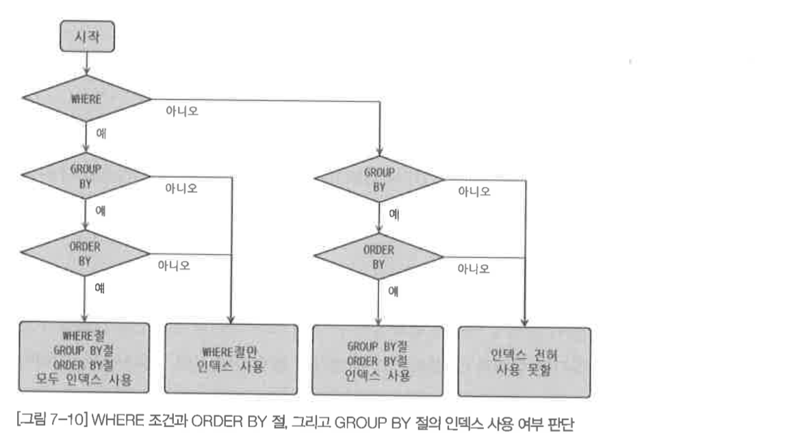

# 7.4.1  ~ 7.4.6

## 7.4.1 SELECT 각 절의 처리 순서

1. FROM
2. JOIN
3. WHERE
4. GROUP BY
5. HAVING
6. WINDOW functions
7. SELECT
8. DISTINCT
9. UNION
10. ORDER BY
11. LIMIT and OFFSET

---

1. 일반적인 쿼리 절의 실행 순서

   

   - 각 요소가 없을 경우 생략
   - 인덱스를 이용할 경우 ORDER BY나 GROUP BY는 생략한다

2. ORDER BY 예외 케이스 실행 순서

   

   - 첫 번째 테이블만 읽어서 정렬 수행 후 나머지 테이블을 읽는다
   - 주로 GROUP BY절이 없이 ORDER BY만 사용된 쿼리에서 사용될 수 있다

3. 인라인 뷰를 이용한 순서 설정

   - 그 외에는 직접 서브 쿼리로 인라인 뷰를 만들어 원하는 순서대로 실행 시킬 수 있다

## 7.4.2. WHERE, GROUP BY, ORDER BY 의 인덱스 사용

### WHERE 절의 인덱스 사용

WHERE 절에서 사용하는 인덱스의 종류

1. 범위 제한 조건 
2. 체크 조건

#### 범위 제한 조건

`=`과 같은 동등 비교 조건, IN 절로 구성된 조건과 같이 얼마나 좌측부터 일치하는가에 따라 다르다.

#### 체크 조건

`>` 과 같은 부등호로 이루어진 조건으로 일치 여부가 아닌 비교로써 사용된다.

---

AND 조건이라면 먼저 결합된 인덱스가 어떤 연산식을 사용했는지가 중요하다. OR조건이라면 하나의 조건에라도 인덱스가 걸리지 않으면 풀 테이블 스캔을 진행하게 된다.

### GROUP BY 절의 인덱스 사용

GROUP BY절에 명시된 칼럼의 순서가 인덱스를 구성하는 칼럼의 순서와 같으면 GROUP BY절은 인덱스를 사용할 수 있다. 조금 풀어서 정리하면 다음과 같다

- GROUP BY절에 명시된 칼럼이 인덱스 칼럼의 순서와 위치가 같아야 한다
- 인덱스를 구성하는 칼럼 중에서 뒷쪽에 있는 칼럼은 GROUP BY절에 명시되지 않아도 인덱스를 사용할 수 있지만, 인덱스의 앞쪽에 있는 칼럼이 GROUP BY절에 명시되지 않으면 인덱스를 사용할 수 없다
- WHERE 조건절과는 달리 GROUP BY절에 명시된 칼럼이 하나라도 인덱스에 없으면 GROUP BY절은 전혀 인덱스를 이용하지 못한다

### ORDER BY절의 인덱스 사용

기본적으로 GROUP BY의 조건과 거의 흡사하다. 추가적으로 조건이 하나 더 있는데, 정렬되는 모든 칼럼이 오름차순이거나 내림차순일 때만 인덱스를 사용할 수 있다.

### WHERE 조건과 ORDER BY(GROUP BY) 절의 인덱스 사용

두 조건 절에 서로다른 인덱스를 사용할 수 있다면 이상적이겠지만 그렇게 하는 것은 불가능하다.

따라서 다음 세 가지 방법중 한가지 방법을 택해야한다.

1. WHERE, ORDER BY 에 같은 인덱스를 사용
   - 가장 빠른 방법이다
   - 가능하다면 이 방법을 사용하도록 튜닝하자
2. WHERE 에만 인덱스를 사용
   - WHERE 절에 일치하는 레코드의 수가 많을때 사용하자
3. ORDER BY 에만 인덱스를 사용
   - 많은 수의 레코드를 정렬해서 조회할 때 사용하자

### WEHRE조건과 ORDER BY, 그리고 GROUP BY절의 인덱스 사용

다음 3개의 질문을 기본으로 해서 그림 7-10의 흐름을 적용해보자

1. WHERE절이 인덱스를 사용하고 있는가?
2. GROUP BY절이 인덱스를 사용할 수 있는가?
3. GROUP BY절과 ORDER BY절이 동시에 인덱스를 사용할 수 있는가?

## 7.4.3 WHERE절의 비교 조건 사용 시 주의사항

### NULL 비교

NULL값은 하나의 값으로 인정되어 관리되며, NULL값이 포함된 레코드도 인덱스로 관리된다. 때문에 평범하게 NULL과 비교하는 쿼리는 인덱스를 이용할 수 있다. ISNULL()으로도 인덱스를 이용할 수 있다.

ISNULL() 함수를 사용하는 것 보다 IS NULL 연산자를 사용하는 것이 더 효율적이다.

### 문자열이나 숫자 비교

타입에 맞춰서 상수를 사용하는 것이 좋다. 타입이 다르다면 인덱스를 이용하지 못한다.

### 날짜 비교

1. DATE나 DATETIME과 문자열 비교

   DATE나 DATETIME 타입의 값과 문자열을 비교할 때는 문자열 값을 자동으로 DATETIME타입으로 변환해서 비교한다. 명시적으로 변환하지 않아도 MySQL이 내부적으로 변환을 수행한다.

   DATE나 DATETIME의 칼럼을 변경하지 않고, 상수가 자동으로 변경되도록 해야 인덱스를 이용할 수 있다.

2. DATE와 DATETIME의 비교

   그냥 비교하면 자동으로 DATE를 DATETIME으로 변환해서 비교한다. 이 때 시간은 00:00:00이다. 이는 인덱스의 사용 여부에 영향을 미치지 않는다.

3. DATETIME과 TIMESTAMP의 비교

   반드시 비교 값으로 사용되는 상수 리터럴을 대상 칼럼의 타입에 맞게 변환해서 사용하는 것이 좋다. 칼럼이 DATETIME이라면 FROM_UNIXTIME()을 이용해 TIMESTAMP값을 DATETIME으로 변환하자. 반대로 칼럼이 TIMESTAMP라면 UNIX_TIMESTAMP() 함수를 이용해 DATETIME을 TIMESTAMP로 변환하자.

---

DATE와 DATETIME을 비교하면 DATETIME에 맞춰 비교를 하고 성능 저하는 일어나지 않는다. 그러나 해당 컬럼의 값들을 문자열로 수정해서 비교를 하는 경우 인덱스를 효율적으로 이용하지 못한다.

언제나 그렇듯 상수를 변형하도록 하자.

## 7.4.4 DISTINCT

MIN(), MAX(), COUNT()와 같은 집합 함수와 함께 사용하는 경우와,  집합 함수 없이 사용하는 두 가지로 구분해서 살펴본다. 집합함수와 같이 DISTINCT가 사용되는 쿼리의 실행 계획에서 DISTINCT 처리가 인덱스를 사용하지 못할 때는 항상 임시 테이블이 있어야 한다. 하지만 Using temporary는 출력되지 않는다.

---

잘못 사용하는 경우가 있는데

`SELECT DISTINCT first_name, last_name FROM employees;` 와 같은 쿼리는 first_name + last_name 을 합친 레코드의 유니크함을 조회하는 것이다.

`SELECT DISTINCT (first_name), last_name FROM employees;` 처럼 괄호를 추가한다고 달라지지 않는다. 

### SELECT DISTINCT

단순히 SELECT되는 레코드 중에서 유니크 레코드만 가져올 때 사용된다. GROUP BY와 거의 유사하게 처리된다. 다만 DISTINCT는 인덱스를 사용하지 못한다면 정렬이 보장되지 않는다. 

### 집합 함수와 함께 사용된 DISTINCT

집합 함수 내에서 사용되는 DISTINCT는 SELECT DISTINCT와 다른 형태로 해석된다. 집함 함수 내에서 사용된 DISTINCT는 집함 함수의 인자로 전달된 칼럼 값들 중에서만 중복을 제거하지만, SELECT DICTINCT는 조회되는 모든 칼럼의 조합 가운데 유일한 값만 가져온다.

## 7.5.5 LIMIT n

LIMIT은 MySQL에만 존재하며 오라클의 ROWNUM과 MS-SQL의 TOP n과 비슷하다. 하지만 작동 방식이 조금 다르기 때문에 주의가 필요하다.

LIMIT은 WHERE 조건이 아니며 항상 쿼리의 가장 마지막에 실행된다. LIMIT은 필요한 레코드 건수만 준비되면 바로 쿼리를 종료시키기 때문에 정렬과 함께 사용한다면 전체 정렬을 하지 않아도 필요한 부분까지만 정렬할 수 있다.

GROUP BY나 ORDER BY와 같은 전체 범위 작업이 선행되더라도 LIMIT은 나름의 성능 향상을 가져올 수 있다.

---

인덱스를 사용하지 못하는 GROUP BY의 경우 그룹핑과 정렬의 작업이 필요하기 때문에 성능 향상에 큰 영향을 미치지 못한다.

ORDER BY의 경우 정렬을 LIMIT에서 필요한 갯수만큼만 정렬을 하고 쿼리를 멈춘다.

## 7.4.6 JOIN

다시한번 살펴보는 인덱스 스캔으로 레코드를 읽는 작업

1. 인덱스 탐색(index seek) : 인덱스 조건에 맞는 값의 위치를 찾는다.
2. 인덱스 스캔(index scan) : 찾은 위치부터 필요한 만큼 인덱스를 읽는다.
3. 인덱스를 읽은 만큼 레코드를 읽어온다.

:arrow_right: 인덱스 풀 스캔은 1의 과정은 필요없지만 2의 과정에서 전부 읽어서 3에 대한 비용이 크다.

:arrow_right: 인덱스 레인지 스캔은 1의 과정에 비용이 크지만 2의 대한 비용이 적다.

---

- 드라이빙 테이블 : 인덱스 탐색과정은 한 번 수행, 그 이후 스캔 실행
- 드리븐 테이블 : 인덱스 탐색, 스캔 과정을 **드라이빙 테이블에서 읽은 레코드 건수 만큼 반복**

따라서 조인에 대한 부하는 드리븐 테이블이 더 큰 비용을 차지하기 때문에 **옵티마이저는 드리븐 테이블을 잘 읽을수 있게 최적화** 한다.

1. 테이블 둘다 인덱스가 있거나 둘다 인덱스가 없는 경우
   - 옵티마이저가 알아서 해준다.
2. 한 테이블만 인덱스가 있는 경우
   - 인덱스를 가지고 있는 테이블을 드리븐 테이블로 지정한다.

### JOIN 칼럼의 데이터 타입

WHERE절에서 타입을 일치시켜야 하는 것 처럼 조인 조건에서도 데이터 타입을 일치시켜야 인덱스를 이용할 수 있다. CHAR과 VARCHAR, INT와 BIGINT, 그리고 DATE와 DATETIME사이에서는 타입 불일치가 일어나지 않는다. 

### OUTER JOIN의 주의사항

OUTER로 조인되는 테이블의 칼럼에 대한 조건은 모두 ON절에 명시해야 한다. 다른 DBMS에서는 아우터 테이블에 대한 비교 조건을 WHERE절에 명시할 수도 있지만 MySQL은 이를 지원하지 않는다. OUTER JOIN으로 연결되는 테이블에 대한 조건을 WHERE절에 사용해야 할 때가 있다. 밑에서 살펴본다.

---

OUTER JOIN 의 조인 컬럼의 조건을 ON 절에 명시하지 않고 WHERE 절에 명시하면 옵티마이저가 INNER JOIN 과 같은 방식으로 처리해버린다.

### OUTER JOIN과 COUNT(*)

페이징 처리를 위해 OUTER JOIN과 COUNT(*)를 자주 함께 사용하곤 한다. 그런데 주로 테이블의 레코드를 가져오는 쿼리에서 SELECT절의 내용만 COUNT(*)로 바꿔서 일치하는 레코드 건수를 조회하는 쿼리를 만들기 때문에 불필요하게 OUTER JOIN으로 연결되는 테이블이 자주 있다. 만약 다음 2가지 조건을 만족한다면 조인에서 불필요한 테이블을 제거하여 같은 결과를 더 빠르게 가져올 수 있다.

1. 드라이빙 테이블과 드리븐(OUTER 조인되는) 테이블의 관계가 1:1 또는 M:1인 경우
2. 드리븐(OUTER 조인되는) 테이블에 조인 조건 이외의 별도 조건이 없는 경우

---

COUNT 를 수행함에 있어 불필요한 조인이 있는지 유의해야하는데 다음 두개의 조건을 만족하면 조인 절을 제거하도록 하자.

1. 조인해서 레코드가 늘어나지 않음 :arrow_right: 1 : 1, N : 1
2. 조인해서 레코드가 줄어들지 않음 :arrow_right: 드리븐 OUTER​ 테이블에 조인 조건외에 아무런 조건이 없는 경우

위 두개를 만족하면 레코드 결과에 아무런 영향을 미치지 않는다.

### OUTER JOIN을 이용한 ANTI JOIN

두 개의 테이블에서 한쪽 테이블에는 있지만 다른 한쪽 테이블에는 없는 레코드를 검색할 때 ANTI JOIN을 이용한다. 일반적으로 NOT IN이나 NOT EXISTS를 사용하지만 5.5 버전 기준으로 이는 비효율적이므로 ANTI JOIN을 사용하는 방법이 좋다. 

NOT IN을 ANTI JOIN으로 변환할 때 WHERE절의 조건에는 반드시 NOT NULL인 칼럼을 선택해야 한다. 또한 OUTER 조인되는 테이블 때문에 레코드의 건수가 더 늘어나지 않을 때만 변환 가능하다.

### INNER JOIN과 OUTER JOIN의 선택

OUTER JOIN을 사용하지 않아도 될 것을 OUTER JOIN으로 사용할 때가 많다. 때로는 반대로 성능을 걱정해서 OUTER JOIN을 억지로 INNER JOIN으로 작성하려는 경우도 있다. 가져와야 할 레코드가 같다면 INNER와 OUTER의 성능 차이는 거의 없다. 성능이 아니라 업무 요건에 따라 선택하는 것이 좋다.

### FULL OUTER JOIN 구현

MySQL에서는 FULL OUTER JOIN을 제공하지 않지만 두 개의 쿼리 결과를 UNION으로 결합하면 FULL OUTER JOIN의 효과를 얻을 수 있따.

일반적으로 UNION은 두 집합의 결과에서 중복 제거가 필요하기 때문에 먼저 각 쿼리에서 중복을 제거하고 UNION ALL을 사용해서 구현하는 것이 더 빠르다.

UNION이나 UNION ALL은 모두 내부 임시 테이블을 사용하므로 쿼리가 느린데 뮤텍스 테이블을 사용하면 이를 개선할 수 있다.

### 조인 순서로 인한 쿼리 실패

ANSI 표준 조인 문법과 조인 조건을 WHERE절에 명시하는 문법을 혼용하거나 ANSI 표준 표기법을 잘못 사용하면 ON절의 조인 조건에 사용된 칼럼을 인식할 수 없다는 에러가 발생한다.

ANSI 표준의 JOIN 구문에서는 반드시 JOIN 키워드의 좌우측에 명시된 테이블의 칼럼만 ON절에 사용할 수 있다. 이는 단순히 JOIN구문의 순서나 ON절의 조건을 조정해서 쉽게 해결할 수 있다.

---

**조인은 반드시 JOIN 좌-우측에 명시된 테이블만 적용**해야한다.

### JOIN과 FOREIGN KEY

FOREIGN KEY를 생성하는 주 목적은 데이터의 무결성을 보장하기 위해서이다. 이를 참조 무결성이라고 표현한다. 굳이 JOIN에 FOREIGN KEY가 필수로 필요하지는 않다.

### 지연된 조인(Delayed Join)

조인은 대체적으로 실행될수록 레코드 건수가 늘어난다. 그래서 조인의 결과를 GROUP BY하거나 ORDER BY하면 조인을 실행하기 전의 레코드를 GROUP BY하거나 ORDER BY하는 것 보다 많은 레코드를 처리해야 한다. 지연된 조인이란 조인이 실행되기 이전에 GROUP BY나 ORDER BY를 처리하는 방식을 의미한다. 주로 LIMIT과 함께 사용하면 더 큰 효과를 얻을 수 있다.

일반적으로 지연된 조인으로 쿼리를 개선했을 때 FROM절의 서브 쿼리가 저장되는 임시 테이블이 드라이빙 테이블이 되어 나머지 테이블과 조인을 수행하므로 임시 테이블에 저장되는 레코드 건수가 작업량에 커다란 영향을 미치게 된다. 그래서 파생 테이블에 저장되어야 할 레코드의 건수가 적으면 적을수록 지연된 조인의 효과가 커진다.

지연된 조인은 항상 사용할 수 있는 것은 아니다. LEFT(OUTER) JOIN인 경우 드라이빙 테이블과 드리븐 테이블은 1:1 또는 M:1관계여야 한다. INNER JOIN의 경우 드라이빙 테이블과 드리븐 테이블은 1:1 또는 M:1관계인과 동시에 드라이빙 테이블에 있는 레코드는 드리븐 테이블에 모두 존재해야 한다. 

---

지연된 조인이란 조인이 실행되기 전에 GROUP BY, ORDER BY 를 먼저 처리하는 방식을 의미한다. LIMIT 절을 같이 사용하면 더 큰 성능적 이점을 얻을 수 있다.

사용하는 방법을 통짜로 된 하나의 쿼리를 서브쿼리로 쪼개서 서브쿼리에서 GROUP BY, ORDER BY, LIMIT 절을 실행해 주는 것이다. 그러면 결과 수가 LIMIT 이하로 줄어들기 때문에 파생 테이블을 이용한다 하더라도 큰 성능상 이점을 얻어갈 수 있다.

이러한 지연된 조인은 페이징 쿼리를 처리할 때 큰 성능 향상을 낼 수 있다.

 LIMIT 10 일 경우에는 지연된 조인을 사용하지 않아도 성능상 문제가 되지 않지만 OFFSET에 해당하는 조건이 생성되면 불필요하게 읽게되는 레코드와 불필요한 조인이 마구 발생하게 된다. 따라서 LIMIT 절을 이용하는 부분을 서브쿼리로 넘겨서 처리하도록 변경하면 성능이 좋아지게 튜닝할 수 있다.

그런데 조건이 있다.

1. LEFT JOIN 의 경우 1:1, 1:N 관계일 것 :arrow_right: 레코드의 결과가 늘어나지 말아야 한다.
2. INNER JOIN 의 경우 레코드의 결과가 늘어나지도 줄어들지도 말아야 한다. 

> 이런 방법도 있지만 no offset 이라는 기법을 이용해서 해결할 수 있다.
>
> [킹졸두](https://jojoldu.tistory.com/528) 님이 해당 방법에 대한 포스팅을 해두셨으니 꼭 보도록 합시다!

### 조인 버퍼 사용으로 인한 정렬 흐트러짐

MySQL에서는 네스티드 루프 방식의 조인만 지원한다. 알고리즘의 특성상 드라이빙 테이블에서 읽은 레코드의 순서가 조인 이후에도 유지된다. 하지만 조인이 실행 되기 위해 조인 버퍼가 사용되면 순서가 달라진다. 

이는 6.3.6절을 참조해 MySQL이 조인 버퍼를 사용하는 방법을 살펴보면 이해할 수 있다.

---

네스티드 루프 방식의 조인으로 인해 보통의 경우 드라이빙 테이블을 기준으로 정렬이 된다.

**하지만**

조인 버퍼를 사용하는 경우 기존 드라이빙 테이블이 드리븐으로, 드리븐 테이블이 드라이빙으로 역전이 된다.  
그래서 '아, 드리븐 테이블 기준으로 정렬되겠다! ㅎㅎ' 할 수 있는데 그냥 맘대로 뒤섞여 버리니까 주의하도록 하자.

> 조인 버퍼를 사용한다는 건 드리븐 테이블이 인덱스를 못써서 드라이빙 테이블의 결과를 메모리에 적재하는 것일텐데  
> 이 때 메모리에 적재할 때 굳이 정렬을 안해도 O(1)의 시간복잡도를 보장하니까 아마 순서가 뒤죽박죽이 되는게 아닐까 싶다.